# otmx-dash

[](https://www.otomax-software.com/en/)
`addon data dashboard untuk aplikasi otomax`

## Sumber

Diadaptasi dari:

- **[Data-Driven Decision Making: A Step-by-Step Guide](https://asana.com/resources/data-driven-decision-making)** (Asana, 2025)
- **[What is Data-Driven Decision-Making? 6 Key Steps](https://www.datamation.com/big-data/data-driven-decision-making/)** (Datamation, 2024)

## motivasi (Data-Driven Decision Making)

**Data-Driven Decision Making (DDDM)** adalah proses penting dalam strategi bisnis modern yang melibatkan pengumpulan data berbasis **Key Performance Indicators (KPIs)** perusahaan dan mengubah data tersebut menjadi **wawasan yang dapat ditindaklanjuti (actionable insights)**.

Pendekatan ini sangat krusial karena memungkinkan perusahaan untuk:

1. **Membuat Keputusan Objektif**: Keputusan didasarkan pada fakta dan bukti, bukan pada intuisi, emosi, atau bias pribadi.
2. **Maksimalisasi Dampak Bisnis**: Memastikan bahwa setiap pilihan yang dibuat didukung oleh data yang bertujuan untuk mencapai tujuan dan memaksimalkan profitabilitas.
3. **Identifikasi Pola dan Prediksi**: Menggunakan data *real-time* dan historis untuk melihat pola yang tersembunyi, membuat inferensi, dan meramalkan tren, sehingga mempermudah pengambilan keputusan strategis, seperti mengoptimalkan operasi dan meningkatkan kinerja tim.

Dengan mengadopsi DDDM, *otmx-dash* bertujuan memberikan *tool* yang terorganisir dan visual untuk memfasilitasi proses pengambilan keputusan yang lebih terinformasi dan terarah bagi pengguna OtomaX.

## type of Analysis & Proses Kunci

Artikel Asana menguraikan 5 langkah utama dalam DDDM, yang dapat dikelompokkan ke dalam jenis-jenis analisis data:

| Tahapan Kunci (DDDM Steps) | Jenis Analisis yang Dilakukan | Penjelasan Sederhana |
| :--- | :--- | :--- |
| **1. Know your vision** | Perumusan Tujuan | Tentukan tujuan yang ingin dicapai (misalnya, peningkatan penjualan). |
| **2. Find data sources** | Pengumpulan Data | Kumpulkan data yang relevan dari berbagai sumber (KPI, ROI, Produktivitas, dll.). |
| **3. Organize your data** | **Descriptive Analytics** | Atur dan visualisasikan data (misalnya, melalui *executive dashboard*) untuk memahami **apa yang sedang terjadi**. |
| **4. Perform data analysis** | **Diagnostic & Predictive Analytics** | Gali data untuk menemukan pola, korelasi, dan "mengapa" suatu masalah terjadi (Diagnostic), serta gunakan pola tersebut untuk **meramalkan tren masa depan** (Predictive). |
| **5. Draw conclusions** | **Prescriptive Analytics** | Tarik kesimpulan yang jelas dan tetapkan langkah selanjutnya (tindakan) untuk mencapai tujuan, **merekomendasikan tindakan** terbaik. |
| **6. Implement & Evaluate** | Implementasi & Monitoring | Terapkan rencana berdasarkan insight, pantau dampaknya, dan lakukan iterasi untuk perbaikan berkelanjutan. |

### Alur DDDM (Data-Driven Decision Making)

```mermaid
graph LR
    A["1️⃣ Know Your Vision<br/>(Perumusan Tujuan)"] -->|"Tujuan Bisnis"| B["2️⃣ Find Data Sources<br/>(Pengumpulan Data)"]
    B -->|"Data Mentah"| C["3️⃣ Organize Your Data<br/>(Descriptive Analytics)"]
    C -->|"Dashboard & Visualisasi"| D["4️⃣ Perform Analysis<br/>(Diagnostic & Predictive)"]
    D -->|"Insight & Pola"| E["5️⃣ Draw Conclusions<br/>(Prescriptive Analytics)"]
    E -->|"Aksi & Rekomendasi"| F["🎯 Keputusan Terinformasi"]
    F -.->|"Feedback Loop"| A

    style A fill:#e1f5ff
    style B fill:#f3e5f5
    style C fill:#fff3e0
    style D fill:#f1f8e9
    style E fill:#fce4ec
    style F fill:#c8e6c9
```



## fitur (Manfaat Tools Data-Driven)

Berdasarkan manfaat dan tools yang dijelaskan dalam artikel (seperti **Business Intelligence/BI Software** dan *reporting software*), *otmx-dash* menyediakan fungsionalitas untuk mendukung DDDM:

- **Dashboards Real-time**: Menyediakan dasbor interaktif yang dapat disesuaikan untuk memantau Key Performance Indicators (KPIs) bisnis secara *real-time*.
- **Data Visualization**: Memudahkan pengguna awam sekalipun untuk memahami kumpulan data yang kompleks melalui grafik, *chart*, dan visualisasi yang jelas.
- **Penyatuan Data**: Mengagregasi data dari berbagai sumber (internal maupun eksternal) untuk analisis yang komprehensif (misalnya, dari data OtomaX dan sumber lain).
- **Peningkatan Kecepatan Keputusan**: Mempersingkat waktu yang dibutuhkan untuk mengambil keputusan yang berdampak signifikan pada laba perusahaan.
- **Analisis Kolaboratif**: Memungkinkan seluruh tim atau organisasi untuk berbagi dan meninjau wawasan data dari berbagai perspektif.

## Manfaat DDDM (Data-Driven Decision Making)

```mermaid
quadrantChart
    title Manfaat Utama DDDM
    x-axis Dampak Negatif --> Dampak Positif
    y-axis Jangka Pendek --> Jangka Panjang
    Customer Experience: 0.8, 0.7
    Strategic Planning: 0.75, 0.9
    Growth Opportunities: 0.7, 0.85
    Operational Efficiency: 0.85, 0.8
    Accurate Forecasting: 0.8, 0.75
```

### Kelima Manfaat Utama

1. **Improved Customer Experience** 🎯
   - Pemahaman yang lebih dalam tentang perilaku dan kebutuhan pelanggan
   - Personalisasi pengalaman pengguna
   - Peningkatan kepuasan dan retensi pelanggan

2. **Better Strategic Planning** 📊
   - Menetapkan tujuan yang dapat dicapai dengan data yang solid
   - Kolaborasi antar departemen dengan pemahaman bersama
   - Keunggulan kompetitif yang berkelanjutan

3. **Growth Opportunities** 🚀
   - Identifikasi peluang pasar baru
   - Temukan area untuk inovasi dan perbaikan
   - Deteksi bottleneck operasional dengan cepat

4. **Increased Operational Efficiency & Optimized Costs** ⚙️
   - Mengungkap produktivitas bottleneck
   - Optimalisasi penggunaan sumber daya
   - Pengurangan biaya operasional melalui forecasting yang akurat

5. **More Accurate Forecasting** 📈
   - Prediksi tren masa depan dengan presisi lebih tinggi
   - Pengurangan error dalam perencanaan
   - Peningkatan efisiensi operasi dan cost savings

## Tantangan & Strategi Mitigasi


### Tantangan Utama yang Perlu Diatasi

| Tantangan | Deskripsi | Strategi Mitigasi |
| :--- | :--- | :--- |
| **Neglecting Data Quality** | Data tidak akurat atau tidak lengkap mengarah ke insight yang salah | Implementasi data validation & cleansing rutin |
| **Scattered Data** | Data tersebar di berbagai departemen tanpa integrasi | Sentralisasi data warehouse & standardisasi format |
| **Data Illiteracy** | Pemahaman data yang terbatas di seluruh organisasi | Program pelatihan data literacy untuk semua level |
| **Historical Data Overreliance** | Hanya mengandalkan data masa lalu tanpa mempertimbangkan tren terkini | Kombinasikan data historis dengan real-time insights |
| **Confirmation Bias** | Memilih data yang sesuai dengan ekspektasi yang sudah ada | Foster critical thinking & encourage alternative perspectives |
| **Poor Communication** | Insight data tidak dikomunikasikan dengan efektif | Visualisasi data yang jelas & storytelling yang kuat |

### Arsitektur Sistem otmx-dash


### Jenis Analytics yang Disediakan


## Best Practices untuk DDDM yang Efektif

### 5 Pro Tips

✅ **Define Clear Objectives**

- Tentukan tujuan bisnis yang spesifik sebelum memulai analisis
- Pastikan data yang dikumpulkan relevan dengan tujuan
- Align keputusan dengan strategic goals organisasi

✅ **Prioritize Accuracy & Reliability**

- Validasi sumber data secara berkala
- Lakukan data cleansing rutin
- Pastikan data quality sebelum analisis

✅ **Combine Data with Context**

- Jangan hanya bergantung pada angka saja
- Pertimbangkan industry trends & market dynamics
- Integrasikan faktor kualitatif dalam decision-making

✅ **Promote a Data-Driven Culture**

- Berikan training data literacy untuk seluruh tim
- Buat data accessible untuk semua level
- Encourage penggunaan data dalam diskusi tim

✅ **Iterate and Learn from Insights**

- Treat DDDM sebagai continuous learning journey
- Review dan adjust strategies berdasarkan hasil
- Belajar dari success maupun failure

## Contoh Penerapan DDDM di Industri

- 🛍️ **Amazon**: Segmentasi pelanggan berbasis location, demographics, & buying behavior untuk targeted marketing
- 🏪 **Walmart**: Predictive analytics untuk optimalisasi penempatan produk dan manajemen inventory
- 🎬 **Netflix**: Data-driven personalization untuk rekomendasi & peningkatan retention rate
- 🚗 **Tesla**: Big data untuk meningkatkan performa kendaraan & customer experience
- 🚗 **Uber**: Matching algorithms & prediction models untuk estimasi waktu perjalanan yang akurat
- ☕ **Starbucks**: Data analytics untuk memahami preferensi pelanggan dan habit patterns
